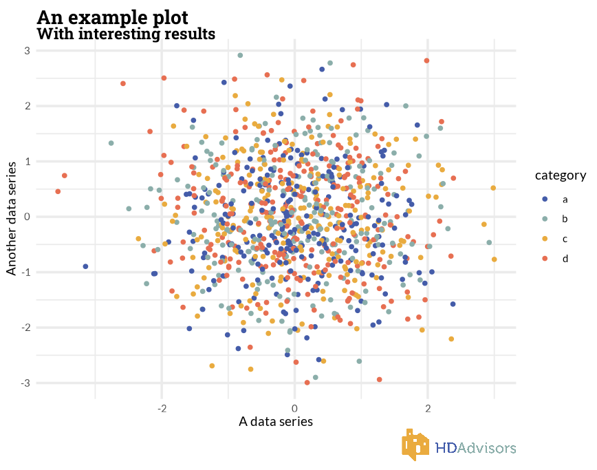

## hdatools

Tools and ggplot2 themes for HDAdvisors projects

Example usage:

```r
remotes::install_github("walkerke/hdatools")

library(hdatools)

library(tidyverse)
library(hdatools)

set.seed(1983)
a <- rnorm(1000)
b <- rnorm(1000)
category <- sample(letters[1:4], 1000, replace = TRUE)

x <- tibble(a, b, category)

ggplot(x, aes(a, b, color = category)) + 
  geom_point() + 
  theme_hda() + 
  scale_color_hda() + 
  labs(title = "An example plot",
       subtitle = "With interesting results",
       x = "A data series",
       y = "Another data series",
       caption = get_logo(type = "hda")) 

```


