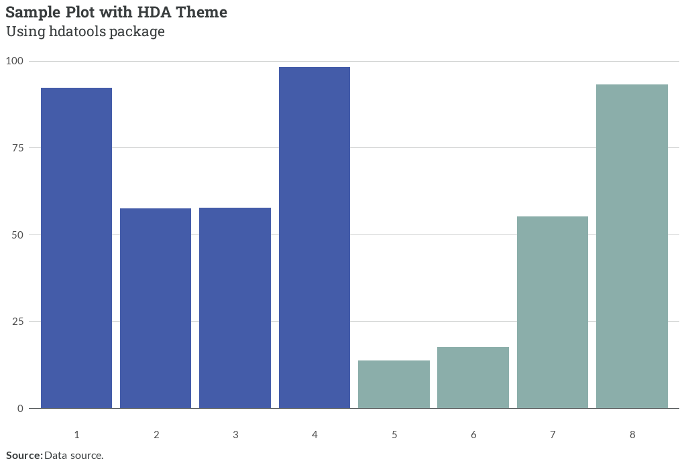

# hdatools

The `hdatools` package provides a set of functions and tools for data analysis and visualization.

## Installation

``` r
# install.packages("devtools")
devtools::install_github("hdadvisors/hdatools")
```

## Features

### Themes

- `theme_hda()`: HDAdvisors-branded ggplot2 theme
- `theme_hfv()`: HousingForward Virginia-branded ggplot2 theme
- `theme_pha()`: PHA-branded ggplot2 theme

### Color Scales

- `scale_color_hda()`, `scale_fill_hda()`: HDA-branded discrete color scales
- `scale_color_hfv()`, `scale_fill_hfv()`: HFV-branded discrete color scales
- `scale_color_pha()`, `scale_fill_pha()`: PHA-branded discrete color scales
- `scale_color_gradient_hda()`: HDA-branded continuous color scale
- `scale_color_gradient_pha()`, `scale_fill_gradient_pha()`: PHA-branded continuous color scales

### Utility Functions

- `add_reliability()`: Add reliability labels based on coefficient of variation
- `fct_case_when()`: Create a factor with case_when logic and automatic level ordering
- `markdown_wrap_gen()`: Generate a function to wrap and format facet labels with markdown
- `add_zero_line()`: Add darker line to zero intercept
- `publish_plot()`: Create dynamic graphic from plot object when document rendered as HTML

## Usage

Basic example:

```r
library(hdatools)
library(tidyverse)

# Create a sample dataset
data <- data.frame(
  x = as.character(c(1:8)),
  y = runif(8, 0, 100),
  group = rep(c("A", "B"), each = 4)
)

# Create a plot with HDA theme and colors
ggplot(data, aes(x, y, fill = group)) +
  geom_col(position = "dodge") +
  scale_fill_hda() +
  add_zero_line() +
  theme_hda() +
  labs(title = "Sample Plot with HDA Theme",
       subtitle = "Using *hdatools* package",
       caption = "**Source:** Data source.")

# Add reliability labels to a dataset
data_with_reliability <- data |> 
  mutate(cv = runif(10, 0, 0.5)) |> 
  add_reliability()

# Create a factor with custom ordering
data_with_factor <- data |> 
  mutate(factor_col = fct_case_when(
    x < 3 ~ "Low",
    x < 7 ~ "Medium",
    TRUE ~ "High"
  ))
```


