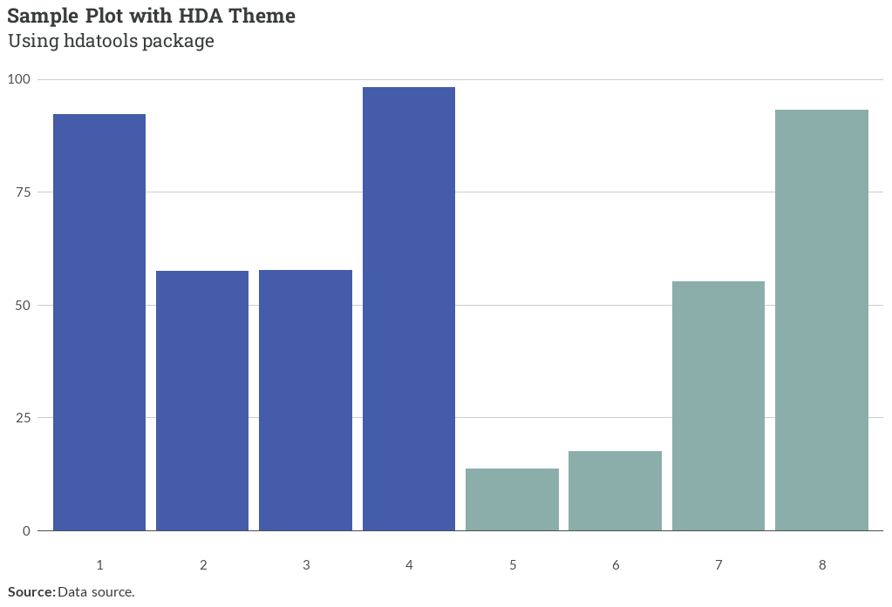

# hdatools

hdatools is HDAdvisors' internal R package for building on-brand charts and
reports. It bundles ggplot2 themes, color scales, and analysis helpers for
four client brands — HDAdvisors (HDA), HousingForward Virginia (HFV), the
Partnership for Housing Affordability (PHA), and VHA. Every report across
these projects looks consistent without hand-tuning each plot.

Each brand gets a matching `theme_*()` ggplot2 theme, discrete color/fill
scales, and continuous sequential/diverging ramps, all checked for
color-vision-deficiency accessibility. A handful of analysis helpers round
it out: reliability labels from a coefficient-of-variation column, factor
recoding with automatic level ordering, and a few small chart-formatting
utilities.

This package is for HDA/HFV teammates building charts in R or Quarto. If you
want to help build hdatools itself, see [CONTRIBUTING.md](CONTRIBUTING.md).

## Quick start

### Install

hdatools isn't on CRAN. Install it from GitHub:

``` r
# install.packages("devtools")
devtools::install_github("hdadvisors/hdatools")
```

### Fonts

hdatools bundles six fonts — Lato, Roboto Slab, Open Sans, Poppins, Noto
Sans, and Montserrat — used by its themes. It registers them with
systemfonts offline the first time you load the package, so there's no
network request and no per-session Google Fonts download.

To supply your own font setup instead, do one of the following before
loading the package:

- Set `options(hdatools.fonts = FALSE)`
- Set the `HDATOOLS_NO_FONTS` environment variable

Rendering plots with these fonts requires a systemfonts-aware graphics
device. In a Quarto document, add this to `_quarto.yml`:

```yaml
knitr:
  opts_chunk:
    dev: "ragg_png"
```

The default Cairo device does not consult the systemfonts registry. Without
this setting, the bundled fonts won't appear in rendered output.

## Features

### Themes

- `theme_hda()`: HDAdvisors-branded ggplot2 theme
- `theme_hfv()`: HousingForward Virginia-branded ggplot2 theme
- `theme_pha()`: PHA-branded ggplot2 theme
- `theme_vha()`: VHA-branded ggplot2 theme

Under ggplot2 >= 4.0, override a theme's `strip.text` (e.g. for faceted
plots) with `ggtext::element_markdown()`, never a raw
`ggplot2::element_text()`. The theme's own strip element is a ggtext
markdown element. ggplot2 4.0 only merges theme elements of the same class.

### Color Scales

- `scale_color_hda()`/`scale_colour_hda()`, `scale_fill_hda()`: HDA-branded discrete color scales
- `scale_color_hfv()`/`scale_colour_hfv()`, `scale_fill_hfv()`: HFV-branded discrete color scales
- `scale_color_pha()`/`scale_colour_pha()`, `scale_fill_pha()`: PHA-branded discrete color scales
- `scale_color_vha()`/`scale_colour_vha()`, `scale_fill_vha()`: VHA-branded discrete color scales

### Continuous ramp scales

Sequential and diverging `colorspace` HCL ramps, one pair per brand. The
HDA/HFV/PHA ramps were tuned and CVD-checked in the Ramp Lab review; VHA's
pair was generated by the same method when VHA was added. HDA's and VHA's
diverging ramps are provisional (see `NEWS.md`).

- `scale_color_hda_c()`/`scale_colour_hda_c()`, `scale_fill_hda_c()`: HDA-branded continuous color/fill scales
- `scale_color_hfv_c()`/`scale_colour_hfv_c()`, `scale_fill_hfv_c()`: HFV-branded continuous color/fill scales
- `scale_color_pha_c()`/`scale_colour_pha_c()`, `scale_fill_pha_c()`: PHA-branded continuous color/fill scales
- `scale_color_vha_c()`/`scale_colour_vha_c()`, `scale_fill_vha_c()`: VHA-branded continuous color/fill scales
- `scale_color_hda_b()`/`scale_colour_hda_b()`, `scale_fill_hda_b()`: HDA-branded binned color/fill scales (7 classes by default)
- `scale_color_hfv_b()`/`scale_colour_hfv_b()`, `scale_fill_hfv_b()`: HFV-branded binned color/fill scales (7 classes by default)
- `scale_color_pha_b()`/`scale_colour_pha_b()`, `scale_fill_pha_b()`: PHA-branded binned color/fill scales (7 classes by default)
- `scale_color_vha_b()`/`scale_colour_vha_b()`, `scale_fill_vha_b()`: VHA-branded binned color/fill scales (7 classes by default)

Each takes `palette = c("sequential", "diverging")` to choose the ramp.

### Utility Functions

- `add_reliability()`: Add reliability labels based on coefficient of variation
- `fct_case_when()`: Create a factor with case_when logic and automatic level ordering
- `markdown_wrap_gen()`: Generate a function to wrap and format facet labels with markdown
- `add_zero_line()`: Add darker line to zero intercept
- `flip_gridlines()`: Flip major gridlines from horizontal to vertical
- `publish_plot()`: Create dynamic graphic from plot object when document rendered as HTML
- `get_logo()`: Get an HDA/HFV logo `` tag for use in a plot
- `get_output_format()`: Detect the current output format (studio, HTML, or PDF)
- `adjust_base_size()`: Adjust a base font size for the detected output format
- `register_hda_fonts()`: Register hdatools' bundled fonts (called automatically on load)
- `hda_colors`/`hfv_colors`/`pha_colors`/`vha_colors`: Named character vectors of each brand's palette hex values
- `hda_color()`/`hfv_color()`/`pha_color()`/`vha_color()`: Return the hex for a named brand color (errors with the valid list on an unknown name)
- `hda_span()`/`hfv_span()`/`pha_span()`/`vha_span()`: Wrap text in a colored `<span>` for use with `ggtext::element_markdown()`
- `hda_focus_pal()`/`hfv_focus_pal()`/`pha_focus_pal()`/`vha_focus_pal()`: Focus/emphasis palette — highlight one series in the brand color, mute the rest to gray

## Usage

Basic example:

```r
library(hdatools)
library(tidyverse)

# Create a sample dataset
data <- data.frame(
  x = as.character(c(1:8)),
  y = runif(8, 0, 100),
  group = rep(c("A", "B"), each = 4)
)

# Create a plot with HDA theme and colors
ggplot(data, aes(x, y, fill = group)) +
  geom_col(position = "dodge") +
  scale_fill_hda() +
  add_zero_line() +
  theme_hda() +
  labs(title = "Sample Plot with HDA Theme",
       subtitle = "Using *hdatools* package",
       caption = "**Source:** Data source.")

# Add reliability labels to a dataset, naming the CV column (percent scale)
data_with_reliability <- data |> 
  mutate(cv = runif(8, 0, 50)) |> 
  add_reliability(cv_col = cv)

# Legacy path: auto-detects a single column ending in "_cv" (0-1 proportion)
data_with_legacy_cv <- data |> 
  mutate(value_cv = runif(8, 0, 0.5)) |> 
  add_reliability()

# Create a factor with custom ordering
data_with_factor <- data |> 
  mutate(factor_col = fct_case_when(
    x < 3 ~ "Low",
    x < 7 ~ "Medium",
    TRUE ~ "High"
  ))
```



## Contributing

Want to help build hdatools itself? See [CONTRIBUTING.md](CONTRIBUTING.md)
for the dev loop, commit/PR conventions, and how to file issues.
