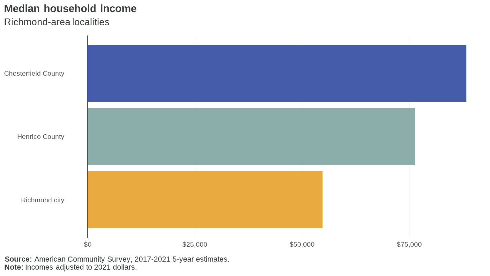
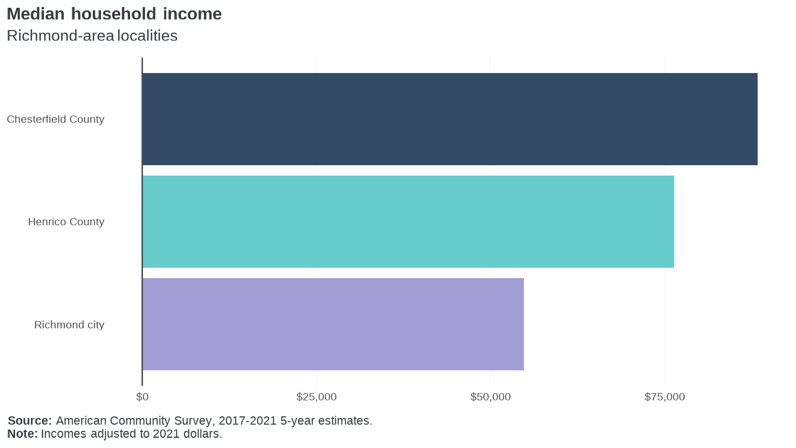

# Using branded themes in hdatools

Let’s get some data. This is median household income for three
Richmond-area localities, from the 2017-2021 5-year American Community
Survey (variable `B19013_001`) — bundled here as a static table so this
article builds without a Census API key or network access:

``` r

library(tidyverse)
library(scales)
library(hdatools)
library(ggtext)

rva_inc <- tribble(
  ~GEOID,  ~NAME,                 ~variable,     ~estimate, ~moe,
  "51041", "Chesterfield County", "B19013_001",  88315,     1599,
  "51087", "Henrico County",      "B19013_001",  76345,     1353,
  "51760", "Richmond city",       "B19013_001",  54795,     1737
)
```

Now, let’s build an HDAdvisors-branded plot:

``` r

ggplot(rva_inc, aes(x = estimate, y = reorder(NAME, estimate), fill = NAME)) +
  geom_col() +
  scale_fill_hda() +
  scale_x_continuous(labels = label_dollar()) +
  theme_hda(flip_gridlines = T) +
  add_zero_line("x") +
  labs(
    title = "Median household income",
    subtitle = "Richmond-area localities",
    caption = "**Source:** American Community Survey, 2017-2021 5-year estimates.<br>**Note:** Incomes adjusted to 2021 dollars."
  )
```



Next, we’ll build a HousingForward Virginia-branded plot:

``` r

ggplot(rva_inc, aes(x = estimate, y = reorder(NAME, estimate), fill = NAME)) +
  geom_col() +
  scale_fill_hfv() +
  scale_x_continuous(labels = label_dollar()) +
  theme_hfv(flip_gridlines = T) +
  add_zero_line("x") +
  labs(
    title = "Median household income",
    subtitle = "Richmond-area localities",
    caption = "**Source:** American Community Survey, 2017-2021 5-year estimates.<br>**Note:** Incomes adjusted to 2021 dollars."
  )
```


