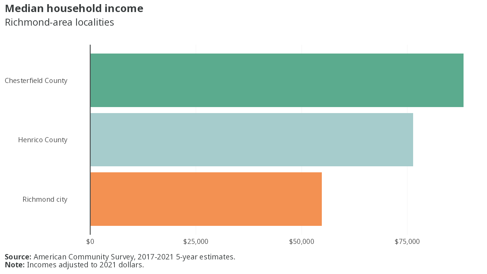
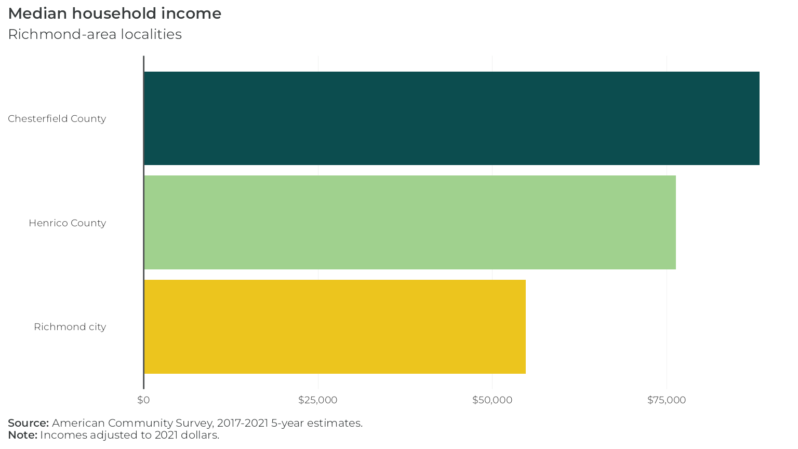
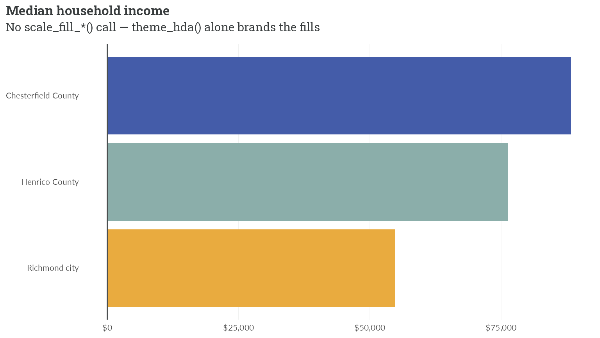

# Using branded themes in hdatools

hdatools ships four branded ggplot2 themes — one per client brand — each
pairing a `theme_*()` with matching `scale_color_*()`/`scale_fill_*()`
color scales. This article builds the same chart in all four so you can
see the brands side by side.

Let’s get some data. This is median household income for three
Richmond-area localities, from the 2017-2021 5-year American Community
Survey (variable `B19013_001`). It’s bundled here as a static table, so
this article builds without a Census API key or network access:

``` r

library(ggplot2)
library(scales)
library(hdatools)

rva_inc <- data.frame(
  NAME     = c("Chesterfield County", "Henrico County", "Richmond city"),
  estimate = c(88315, 76345, 54795)
)
```

Each plot below differs only in its `scale_fill_*()` and `theme_*()`
call. Everything else is identical.

First, an HDAdvisors-branded plot:

``` r

ggplot(rva_inc, aes(x = estimate, y = reorder(NAME, estimate), fill = NAME)) +
  geom_col() +
  scale_fill_hda() +
  scale_x_continuous(labels = label_dollar()) +
  theme_hda(flip_gridlines = TRUE) +
  add_zero_line("x") +
  labs(
    title = "Median household income",
    subtitle = "Richmond-area localities",
    caption = "**Source:** American Community Survey, 2017-2021 5-year estimates.<br>**Note:** Incomes adjusted to 2021 dollars."
  )
```


The same chart with HousingForward Virginia branding:

``` r

ggplot(rva_inc, aes(x = estimate, y = reorder(NAME, estimate), fill = NAME)) +
  geom_col() +
  scale_fill_hfv() +
  scale_x_continuous(labels = label_dollar()) +
  theme_hfv(flip_gridlines = TRUE) +
  add_zero_line("x") +
  labs(
    title = "Median household income",
    subtitle = "Richmond-area localities",
    caption = "**Source:** American Community Survey, 2017-2021 5-year estimates.<br>**Note:** Incomes adjusted to 2021 dollars."
  )
```


With PHA branding:

``` r

ggplot(rva_inc, aes(x = estimate, y = reorder(NAME, estimate), fill = NAME)) +
  geom_col() +
  scale_fill_pha() +
  scale_x_continuous(labels = label_dollar()) +
  theme_pha(flip_gridlines = TRUE) +
  add_zero_line("x") +
  labs(
    title = "Median household income",
    subtitle = "Richmond-area localities",
    caption = "**Source:** American Community Survey, 2017-2021 5-year estimates.<br>**Note:** Incomes adjusted to 2021 dollars."
  )
```



And with VHA branding:

``` r

ggplot(rva_inc, aes(x = estimate, y = reorder(NAME, estimate), fill = NAME)) +
  geom_col() +
  scale_fill_vha() +
  scale_x_continuous(labels = label_dollar()) +
  theme_vha(flip_gridlines = TRUE) +
  add_zero_line("x") +
  labs(
    title = "Median household income",
    subtitle = "Richmond-area localities",
    caption = "**Source:** American Community Survey, 2017-2021 5-year estimates.<br>**Note:** Incomes adjusted to 2021 dollars."
  )
```



Under ggplot2 \>= 4.0, a bare `theme_*()` with no `scale_*()` call also
brands the plot, via the theme-carried palette. The `scale_fill_*()`
line above is optional when the brand’s default palette order is what
you want:

``` r

ggplot(rva_inc, aes(x = estimate, y = reorder(NAME, estimate), fill = NAME)) +
  geom_col() +
  scale_x_continuous(labels = label_dollar()) +
  theme_hda(flip_gridlines = TRUE) +
  add_zero_line("x") +
  labs(
    title = "Median household income",
    subtitle = "No scale_fill_*() call — theme_hda() alone brands the fills"
  )
```


